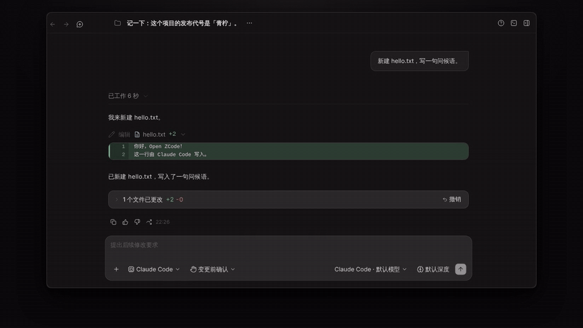
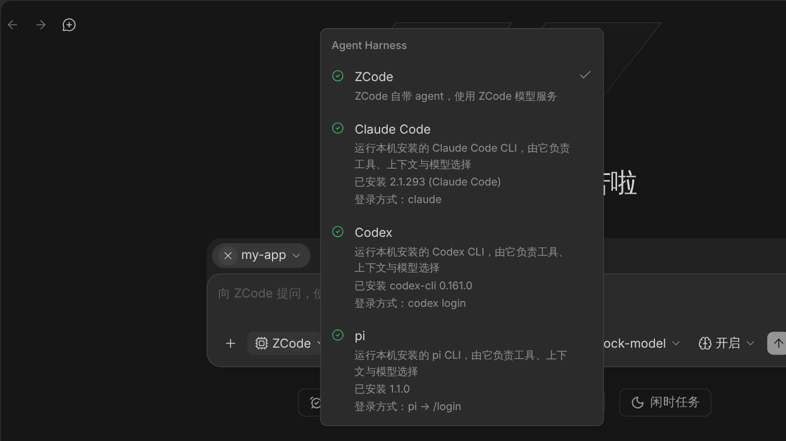
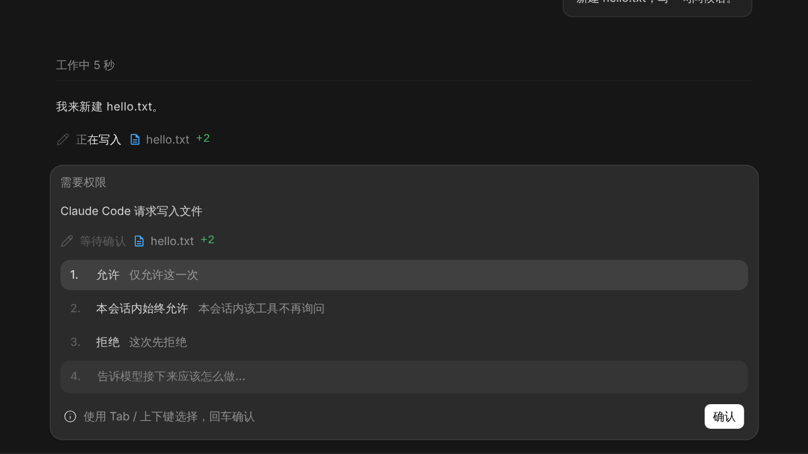
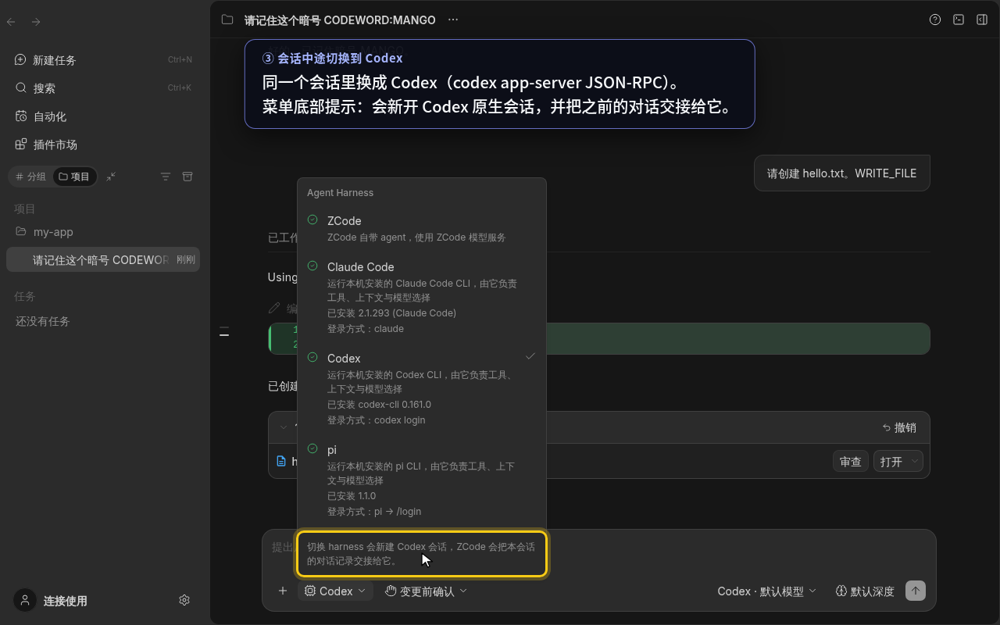
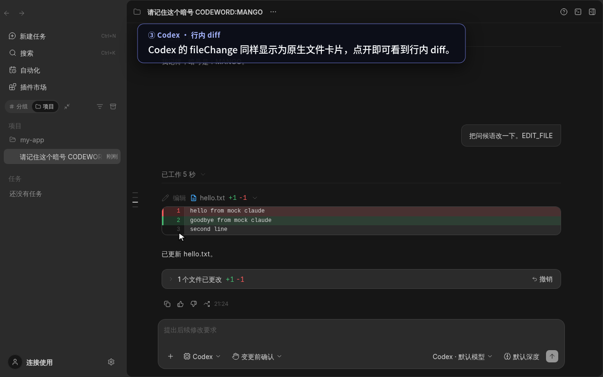
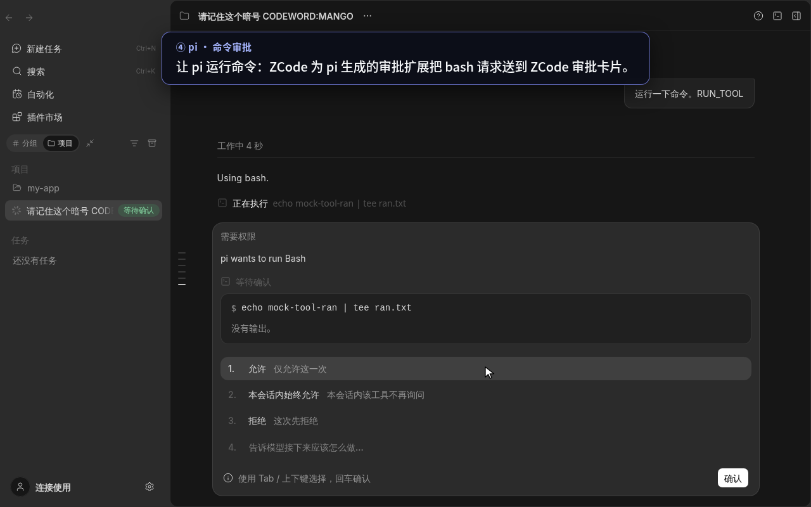
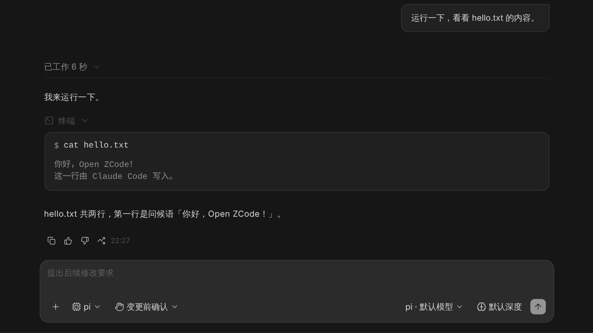

# Open ZCode

<p align="center">
  
</p>
<p align="center">
  <b>在 ZCode 里为每个会话选择后台运行的 Agent Harness：ZCode / Claude Code / Codex / pi</b><br/>
  简体中文 · <a href="#english">English</a>
</p>

Open ZCode 基于开源的 AI 编程工作台 [ZCode](https://github.com/zai-org/ZCode)（Apache-2.0）。它在 ZCode 的桌面端和 Web 界面上增加了**可选 Agent Harness**。每个会话都能在输入框里选择由谁来跑 agent loop：可以是 ZCode 自带的 agent，也可以是本机安装的 **Claude Code**、**Codex** 或 **pi** CLI。ZCode 仍然负责界面、会话、审批、diff 和撤销。

> 本项目是社区分支，与 Z.AI、Anthropic、OpenAI 或 pi 的作者均无隶属或背书关系。

## 演示



▶ 完整演示视频（2 分 33 秒，中文界面与字幕）：[docs/media/zcode-selectable-harness-demo.mp4](docs/media/zcode-selectable-harness-demo.mp4)，也可在 [v0.1.0 Release](https://github.com/betacatsling/Open-ZCode/releases/tag/v0.1.0) 下载。

> 演示里的 claude / codex / pi 都是真实安装的 CLI，但它们的模型请求指向本机的 mock 模型服务，没有调用真实模型 API，也没有使用真实密钥。

| Harness 菜单（安装状态 / 版本 / 登录提示） | Claude Code 写文件 → ZCode 审批卡片      |
| ------------------------------------------ | ---------------------------------------- |
|         |    |
| **中途切换到 Codex：交接提示**             | **Codex 编辑的行内 diff（可撤销）**      |
|  |  |
| **pi 的 bash 审批**                        | **pi 的原生终端工具卡片**                |
|          |       |

## 功能

- **按会话选择 harness**：输入框左下角的 Harness 菜单显示每个 CLI 是否已安装、版本号以及如何登录。选择会随会话保存。
- **原生协议，不经过 ACP**（上游 ZCode 已退役 ACP）：

  | Harness     | 接入方式                                               | 审批桥接                                                            |
  | ----------- | ------------------------------------------------------ | ------------------------------------------------------------------- |
  | Claude Code | `claude` stream-json，`--permission-prompt-tool stdio` | `can_use_tool` → ZCode 审批卡片 → `control_response`                |
  | Codex       | `codex app-server`（JSON-RPC）                         | 命令 / 文件改动审批 → accept / acceptForSession / decline           |
  | pi          | `pi --mode rpc`，加上 ZCode 生成的审批扩展             | `ctx.ui.confirm` → `extension_ui_request` / `extension_ui_response` |

- **原生展示**：工具调用、思考过程和文件 diff 都用 ZCode 自己的卡片显示。外部 harness 改动的文件也会生成工作区检查点，可以审查、打开和一键撤销。
- **权限模式映射**：ZCode 的 plan / build / edit / auto / yolo 会映射到各 harness 自己的权限模式或沙箱策略。完整对照表见[设计文档](docs/agent-harness.md)。
- **会话连续性**：连续使用同一个 harness 时，续接它的原生会话。中途切换 harness 时，新开一个原生会话，并把之前的对话以交接块的形式带过去。
- **模型 / 思考深度菜单跟随 harness**：每个 harness 列出自己的模型选项和思考档位。
- **CLI 同样支持**：`zcode -p "…" --harness claude-code|codex|pi [--harness-model <模型>] [--harness-thought <档位>]`。

## 安装与运行

需要 Git、Node.js **24.14.0** 和 pnpm **10.33.2**（版本以 [mise.toml](mise.toml) 为准）。

```bash
git clone https://github.com/betacatsling/Open-ZCode.git
cd Open-ZCode
pnpm bootstrap                      # 安装依赖并构建基础包

# 构建 Agent CLI（harness 适配器和运行时都在这里）
pnpm --filter @zcode/cli... build

# Web 开发模式：前端 http://localhost:5173，后端 http://localhost:3030
ZCODE_SERVER_WORKSPACE=/path/to/your/project pnpm dev:web

# 或者桌面版
pnpm dev:desktop
```

如果 Harness 菜单一直显示“未检测”，说明后端没有找到 ZCode agent 进程。可以显式指定：

```bash
export ZCODE_AGENT_SERVER_COMMAND=node
export ZCODE_AGENT_SERVER_ARGS_JSON='["<仓库路径>/apps/zcode-cli/packages/cli/dist/zcode.cjs","app-server","--stdio"]'
```

更完整的构建、打包和发行说明见上游 README：[docs/upstream/README.zh-CN.md](docs/upstream/README.zh-CN.md)。

## 安装并登录各 CLI

| Harness     | 安装                                             | 登录                                                    |
| ----------- | ------------------------------------------------ | ------------------------------------------------------- |
| Claude Code | `npm install -g @anthropic-ai/claude-code`       | 运行 `claude`，按提示登录（或配置 `ANTHROPIC_API_KEY`） |
| Codex       | `npm install -g @openai/codex`                   | `codex login`（或配置 `OPENAI_API_KEY`）                |
| pi          | `npm install -g @earendil-works/pi-coding-agent` | 运行 `pi`，输入 `/login`（或按 pi 文档配置提供商）      |

- 凭据和模型配置都由各 harness 自己管理。ZCode 不会把自己的 Provider 凭据注入给它们，harness 进程只继承 agent 进程的环境变量。
- ZCode 从登录 shell 的 `PATH` 和常见安装目录里查找可执行文件。也可以用 `ZCODE_CLAUDE_CODE_PATH`、`ZCODE_CODEX_PATH`、`ZCODE_PI_PATH` 直接指定路径。
- 装好之后，在输入框左下角的 Harness 菜单里选择即可。

## 已知限制

- 只在 Linux 上验证过。三个 CLI 的端到端测试使用本地 mock 模型服务，没有用真实账号跑过。macOS / Windows 上的可执行文件查找和桌面版还没有验证。
- 外部 harness 运行期间不能中途插话调整；排队的输入不带 harness 信息；附件不会传给外部 harness；ZCode 的 hooks 和上下文注入在外部 harness 轮次中跳过；`/compact` 原样交给 harness 处理。
- 回退（rewind）不会重置 harness 的原生会话。每个会话只保留最近一次的原生会话绑定。
- 审批卡片标题（例如 “Codex wants to run Edit”）暂未本地化。新建文件的卡片沿用 ZCode 现有的 “编辑” 标签。
- 模型菜单目前是静态的：Claude Code 提供 默认 / Sonnet / Opus / Haiku；Codex 和 pi 只有“默认模型”（沿用 CLI 自己的配置，命令行可用 `--harness-model` 指定）。思考档位按 harness 分别列出。
- 没有桥接 Codex 的 elicitation，也没有桥接 pi 除确认框以外的对话框；子代理的内部过程不显示；可用性检测结果缓存 30 秒。

设计细节、上游 ACP 退役的调查、权限映射表和待讨论问题见 [docs/agent-harness.md](docs/agent-harness.md)。

## 许可与致谢

- 本项目沿用 [Apache License 2.0](LICENSE)。原始代码版权归 Z.AI Co., Ltd 所有，详见 [NOTICE](NOTICE)、[NOTICE.md](NOTICE.md) 和 [THIRD-PARTY-NOTICES.md](THIRD-PARTY-NOTICES.md)。
- 上游项目：[zai-org/ZCode](https://github.com/zai-org/ZCode)。本仓库保留了上游提交历史，harness 相关改动见 `feat(shared)` / `feat(adapters)` / `feat(runtime)` / `feat(ui)` / `docs` 这几个提交。
- 外部 harness：[Claude Code](https://github.com/anthropics/claude-code)、[Codex CLI](https://github.com/openai/codex)、pi（`@earendil-works/pi-coding-agent`）。它们各自遵循自己的许可和服务条款，本仓库不包含它们的代码。

---

<a id="english"></a>

## English

**Open ZCode** is a community fork of [ZCode](https://github.com/zai-org/ZCode) (Apache-2.0), an AI coding workbench. In ZCode's desktop and web UI, you can choose **per session** which agent harness runs the agent loop: ZCode's built-in agent, or a locally installed **Claude Code**, **Codex**, or **pi** CLI. ZCode still owns the UI, sessions, approvals, diffs, and undo.

> Not affiliated with or endorsed by Z.AI, Anthropic, OpenAI, or the pi authors.

**Demo:** see the GIF above, the full video at [docs/media/zcode-selectable-harness-demo.mp4](docs/media/zcode-selectable-harness-demo.mp4) (2:33, Chinese UI and captions), or the [v0.1.0 release](https://github.com/betacatsling/Open-ZCode/releases/tag/v0.1.0). The CLIs in the demo are real, but they talk to a local mock model server. No real model APIs or keys are used.

**Features**

- A harness picker in the composer. It shows whether each CLI is installed, its version, and how to log in. The selection is saved per session.
- Each harness uses its native protocol, not ACP (which upstream ZCode has retired):
  - Claude Code: `stream-json` with `--permission-prompt-tool stdio`
  - Codex: `codex app-server` (JSON-RPC)
  - pi: `pi --mode rpc` plus a generated approval extension
- Tool calls, reasoning, and file diffs render as native ZCode cards. File changes made by a harness become workspace checkpoints, so you can review, open, and undo them.
- Approvals from every harness go through ZCode's approval card. ZCode's permission modes (plan / build / edit / auto / yolo) are mapped to each harness's own modes and sandbox policies.
- Continuity: using the same harness again resumes its native session. Switching harness mid-session starts a new native session with a transcript handoff.
- The model and effort menus follow the selected harness.
- CLI: `zcode -p "…" --harness claude-code|codex|pi [--harness-model <model>] [--harness-thought <level>]`.

**Install & run**

```bash
git clone https://github.com/betacatsling/Open-ZCode.git && cd Open-ZCode
pnpm bootstrap && pnpm --filter @zcode/cli... build
ZCODE_SERVER_WORKSPACE=/path/to/project pnpm dev:web   # http://localhost:5173
```

Then install and log in to the CLIs you want to use:

- Claude Code: `npm i -g @anthropic-ai/claude-code`, then run `claude`
- Codex: `npm i -g @openai/codex`, then `codex login`
- pi: `npm i -g @earendil-works/pi-coding-agent`, then run `pi` and `/login`

Each CLI manages its own credentials; ZCode never injects its provider keys. To point ZCode at specific executables, set `ZCODE_CLAUDE_CODE_PATH`, `ZCODE_CODEX_PATH`, or `ZCODE_PI_PATH`. For the full build and packaging guide, see [docs/upstream/README.en.md](docs/upstream/README.en.md).

**Limitations:** see the Chinese section above and [docs/agent-harness.md](docs/agent-harness.md). In short:

- Verified on Linux only, with a mock model server.
- No mid-turn steering, attachments, or ZCode hooks during harness turns.
- Rewind doesn't reset the harness's native session.
- Approval titles aren't localized yet. Model menus are static: Claude Code offers Default / Sonnet / Opus / Haiku; Codex and pi offer only their CLI default.

**License & credits:** Apache-2.0 (see [LICENSE](LICENSE), [NOTICE](NOTICE)). The original code is © Z.AI Co., Ltd ([zai-org/ZCode](https://github.com/zai-org/ZCode)); upstream history is preserved. Claude Code, Codex, and pi are separate products under their own licenses and terms.
